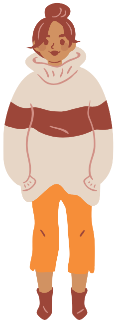

# Work Life Balance Game ⚖️

## Introduction

This is a browser-based game built with HTML, CSS, JavaScript, DOM manipulation, and Object-Oriented Programming (OOP).
It’s my first project at Ironhack (Module 1).

The goal? Balance between work and life before things get out of control!

## 🖼️ Game Screens

The game has three main screens:

- **Intro / How to Play**
- **The Game** – moving a player to catch/avoid objects
- **Game Over** – shows your score and a restart button

---

### 🕹️ How to Play

#### <u>A player</u>

 Move a character with the arrow keys on your keyboard (⬅️ ➡️ ⬆️ ⬇️).

#### <u>Catch or avoid items</u>

Every item changes the stats: _energy_, _money_, _time_ and _resilience_ levels.

| Item                                                                  | Name           | Energy | Money  | Time   | Is it challenging? |
| --------------------------------------------------------------------- | -------------- | ------ | ------ | ------ | ------------------ |
|  | **Extra work** | 📉📉   | ✅     | ⏱️     | Yes! ⚡            |
|              | **Good Sleep** | 📈😃   |        | ⏱️⏱️   |                    |
|                | **Gym**        | 📉     | 🔻     | ⏱️     | Yes! ⚡            |
|        | **Friends**    | 📈😃   | 🔻     | ⏱️     |                    |
|      | **Conflict**   | 📉     |        | ⏱️     | Yes! ⚡            |
|          | **Vacation**   | 📈📈😃 | 🔻🔻🔻 | ⏱️⏱️⏱️ |                    |
|            | **Crowd**      | 📉     |        |        | Yes! ⚡            |

#### ⚡ <u>Challenging items</u>

Some items are tough at first (take _energy_) but build _resilience_:

- **Extra work** 
- **Gym** 
- **Conflict** 
- **Crowd** 

They may cost _energy_ in the moment, but they increase _resilience_, making similar challenges easier later (take less _energy_).

#### <u>Game Over Conditions</u>

The game ends when:

- Time runs out ⏱️

- Money is depleted 💸

- Energy drops to zero 🔋

👉 Try to keep your work-life balance as long as possible!

---

### Play the game:

[Click here to open in your browser](https://verav.github.io/work-life-balance-game-project/)

---

### Created by:

[Vera Fileyeva](https://github.com/VeraV)
